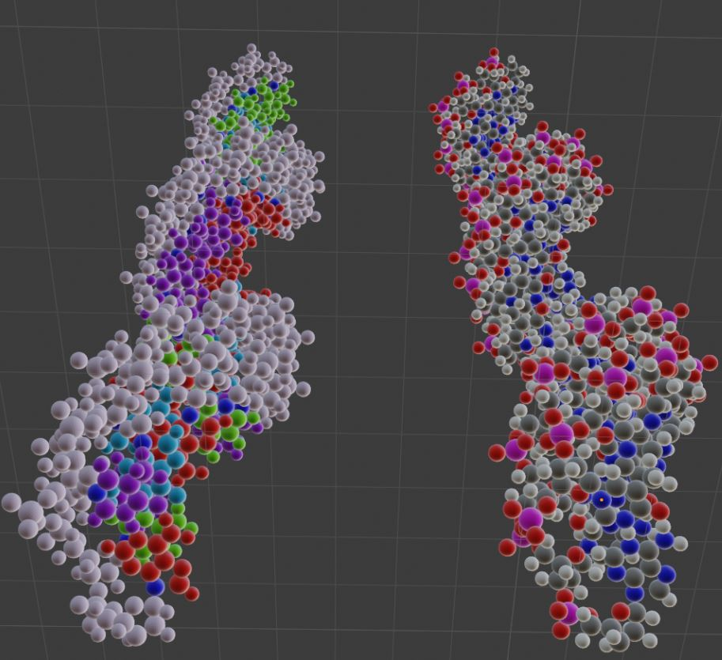

# helices

  

  

  

## Background

Although significant packages exist for rendering proteins in Blender, few resources exist for creating molecules without directly specifying atom and bond locations (Andrei, 2012). Two molecules highly suited to procedural modeling are deoxyribonucleic acid (DNA) and ribonucleic acid (RNA), two of the fundamental building blocks of life. In nature, DNA and RNA, known as nucleic acids, store the coded instructions that give rise to all life on Earth. As an example, human DNA could be considered as a procedural modeling algorithm that generates an entire person from a single cell with unparalleled robustness. Their structural features are worthy of visualization and study, since they are the oldest, densest, and most prevalent forms of information storage on this planet (Dong, 2020).

Nucleic acids can be found in nature as single-stranded (ss) or double-stranded (ds) helices, with each strand a biopolymer assembled from a sequence of nucleotides. The nucleotides that comprise DNA and RNA are created by linking a phosphate molecule, a sugar, and a nitrogen-containing base in that order. Nucleotides are connected to each other by linking the phosphate of one nucleotide to the sugar of a subsequent nucleotide. This sugar-to-phosphate ordering creates a directionality, commonly known as 5’ to 3’. In DNA, the sugar is deoxyribose. In RNA, the sugar is ribose. In double-stranded nucleic acids, strands run in opposite directions. The double-stranded form contains two complementary sequences, but each strand alone contains all the information of the molecule. This allows the entire nucleic acid to be recreated from either strand for convenient replication, which also facilitating error correction. The nitrogen-containing bases used include adenine (A), cytosine (C), guanine (G), thymine (T - DNA only), and uracil (U - RNA only). Though nucleotides are held together internally by strong covalent bonds, opposite strands are joined by hydrogen bonds, which are individually weak but highly numerous (Albert.io, 2019).

## Objective

The goal of this project is to create four techniques for Blender that can effectively model and animate nucleic acids when used in conjunction. Additionally, several functions were given corresponding interfaces to improve user accessibility. All code was written in Python and documented in chang_techniques.py. Numerical constants used for model accuracy were obtained from several reviews (Ho, 1994) (Rich, 1984) (Sinden, 1994).

## Techniques

#### Technique 1: copyRec, seleRec, coloRec, joinRec, makeMolecule

This technique can iteratively construct structures by repeatedly appending several groups to a parent group. A space-filling model (where atoms are represented by spheres of appropriate radii and bonds are indicated by proximity) can be used to construct any molecule. 

This technique was enhanced in several ways for the final project. Instead of joining meshes into a single, inflexible structure, structures are now represented as directed tree graphs with arrow-shaped empties (structures that are not rendered but provide useful pivot points) serving as the edges. The empties also allow users to easily stylize bonds by applying functions to these empties. A connection from B to C is represented by an empty E, where B is the parent to E and E is the parent to C. 

Several functions also allow members of this tree to be recursively copied, selected, colored, or joined alongside their descendants. In tandem, these functionalities allow users to perform extensive manual adjustments to their molecules, accounting for irregularities such as rings (which were previously impossible to perfectly close). It’s even possible to create materials and assign them to molecule structures programmatically!

#### Technique 2: makeSkeleton, clearChildren, makeHelix

This technique can take a set of objects and use it as a dictionary of groups for rungs in the helix, which are matched to a sequence of strings corresponding to the names of the rungs. In the context of nucleic acids, it creates a single-stranded or double-stranded helix from a sequence of bases.

For the final project, a major improvement was again possible by using empties. Each rung no longer consists of one or two arbitrarily placed structures. Instead, rung meshes are assigned as the children of a rotator empty, which itself becomes the child of a reference empty. The position and direction of the reference empty form the z-axis of rotation for the rotator empty. This allows for manual adjustments to the path and angles of the helix, which is no longer constrained about a single line.

The skeleton of empties is generated by makeSkeleton, which is then adorned by makeHelix. By compartmentalizing these roles, it is also possible to rapidly repurpose a skeleton through clearChildren, which removes the adornments. The skeleton alone can be used to model movement for a far lower computational cost, while the relative positions allow for more streamlined calculations and faster helical generation as a whole.

#### Technique 3: rotateBond

The purpose of this technique is to allow an object to rotate about an axis specified by an empty. Molecules are not static meshes - they are highly dynamic and can change their form, or conformation, in response to even the slightest perturbations in their environmental conditions. Since empties frequently resemble molecular bonds, the technique is named rotateBond. 

#### Technique 4: rotateSimilars, coilCollection

The purpose of this technique is to allow for the coiling / uncoiling of a helix about a user-defined path. rotateSimilars plays a critical role in ensuring that corresponding parts of a nucleotide base rotate similarly, which can help avert collisions and programmatically ensure identical animation keyframes across all bases in a helix. coilCollection acts upon the rotator empties of a helix through rotateBond, coordinating rotation speeds to make a smooth coiling / uncoiling effect. Given the compartmentalization of rotation to the rotator relative to the reference empty, it is also possible for the reference empty to move and rotate without affecting helical coiling / uncoiling.

#### Interface

In addition to these four techniques, several relevant helper functions can be registered to an interface through Blender’s API. These functions usually act on selected objects and perform relatively simple actions, which can free up time and cognitive attention for using more complex techniques or functionalities.

## Future Directions

Future directions for this project may include:
Creating a graphical user interface to allow for more intuitive parameter adjustment.
Adding methods for atomic representation beyond the space-filling model (ex: ball-and-stick, molecular orbitals, allowing users to vary radius size).
Perfecting the mathematics behind polygonal arrangements of atoms (ex: certain pentagons don’t quite line up).

## Bibliography

#### Literature
Andrei, Raluca Mihaela, et al. "Intuitive representation of surface properties of biomolecules 
using BioBlender." BMC bioinformatics 13.S4 (2012): S16.

“Base Pair.” Genome.Gov, https://www.genome.gov/genetics-glossary/Base-Pair. Accessed 17 
Oct. 2020.

Dong, Yiming, et al. "DNA storage: research landscape and future prospects." National Science 
Review (2020).

Ho PS (1994-09-27). "The non-B-DNA structure of d(CA/TG)n does not differ from that of 
Z-DNA". Proc Natl Acad Sci USA. 91 (20): 9549–9553. Bibcode:1994PNAS...91.9549H. doi:10.1073/pnas.91.20.9549. PMC 44850. PMID 7937803.

Rich A, Norheim A, Wang AH (1984). "The chemistry and biology of left-handed Z-DNA". 
Annual Review of Biochemistry. 53: 791–846. doi:10.1146/annurev.bi.53.070184.004043. PMID 6383204.

Sinden, Richard R (1994-01-15). DNA structure and function (1st ed.). Academic Press. p. 398. 
ISBN 0-12-645750-6.

“What Are the Three Parts of a Nucleotide? | Albert.Io.” Albert Resources, 14 Dec. 2019, 
https://www.albert.io/blog/what-are-the-three-parts-of-a-nucleotide/.

#### Additional Images:
http://www.cryst.bbk.ac.uk/PPS95/course/3_geometry/rama.html

https://www.web-books.com/MoBio/Free/images/Ch2B3.gif

http://www.phschool.com/science/biology_place/biocoach/biokit/chnops.html

https://chem.libretexts.org/@api/deki/files/107106/ethane_rotation.png?revision=1&size=bestfit&width=642&height=82

https://www.researchgate.net/profile/Robin_Strickstrock/publication/324056789/figure/fig5/AS:609047246024705@1522219587228/Potential-energy-curve-of-the-rotation-about-the-C-C-bond-in-ethane-Depending-on-the.png

## Image Gallery

 
Image 1: A collection of molecules and helices produced by makeMolecule and makeHelix.
  

 
Image 2: A collection of molecules produced by the recursive usage of makeMolecule. Columns from left to right: phosphate-sugar backbones, adenine, thymine, uracil, cytosine, guanine, colored backbones, colored bases, complete nucleotides, colored nucleotides.
  

 
Image 3: A collection of the basic building blocks from which all constructs are made. Top row from left to right: uracil, thymine, guanine, cytosine, adenine. Bottom row from left to right: phosphorus, carbon, nitrogen, oxygen, hydrogen.
  

 
Image 4: A representation of Adenine (right) pairing with Thymine (left). Just like in a real molecule, the two molecules are separate meshes because they are bound by hydrogen bonds (the blue-white-blue and red-white-blue linear motifs in the center). Note also that the phosphate-sugar backbones are pointing in opposite directions - this makes sense, as the two bases should be on opposite strands.
  

 
Image 5: Two highly accurate models of a 24-nucleotide double-stranded DNA sequence. Features include (i) 10.5 base pairs per rotation about their axis, (ii) a radius of 1 nm, (iii) right-handedness, (iv) 1.2 degrees of tilt per base relative to the horizontal, (v) 135 degrees of rotation from the reference strand to the complement strand. The phosphate-ribose backbone has been stretched by 3x for easier visualization, with each base separated by 3 * 0.332 nm.
  

 
Image 6: Four examples of how adjusting parameters can lead to a diversity of results. From left to right: increased tilt angle for dsDNA, reversed rotation per base about the z-axis for ssDNA, no rotation per base for ssRNA, realistic ssRNA.
  

 
Image 7: Two examples of basic blocks being used in place of molecules, demonstrating the applicability of makeHelix to a variety of situations. Top: dsDNA with a unique complement function that pairs each base with itself. Bottom: dsRNA with extreme exaggeration of tilt and base rotation. Though not realistic, this reflects the style of many drawings in older textbooks.
  

 
Image 8: A group of helper functions that can be used from the interface, increasing their convenience.
